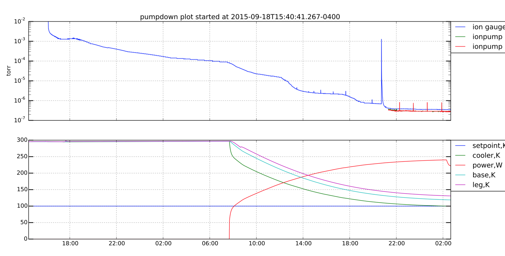

Pumpdown and cooldown
---------------------

Since the XCU actor controls the gatevalve, the turbo pump, the
cryocoolers, and the temerature board, it is the single point of
control for pumpdown and cooldown.

The timeline is pretty straightforward. Here is a plot from a mostly
correct example:

:download:`pdf <includes/pumpdown6_start.pdf>`

The basic timeline is as follows.

 1. With the dewar and the roughing line at atmosphere, install the
    gate valve interlock jumper, open the gate valve and start the
    roughing pump.
 2. At 1 Torr, turn on the turbo pump.
 3. At 1e-4 Torr (roughly 16 hours later), turn on the cryocooler.
 4. At 1e-6 Torr (roughly 12 hours later), turn on the ion pump.
 5. The pressure should stabilize shortly thereafter, in the low 10^-7
    Torr range.
 6. Close the gate valve, turn off the turbo pump, remove the interlock jumper.

The gate valve can only safely be opened when the outside and inside
pressure are within XXXX. In practice, this means that either:

 - Both the dewar and the roughing line must be at atmosphere, confirmed by 
 - Both the dewar and the roughing line must be below 1e-3 Torr. XXXX

In the first cas

 1. open gatevalve ``gatevalve open``. If the command succeeds, the
    valve should be open. The ``gatevalve`` keyword will also show the
    state of valve control.
 
 
